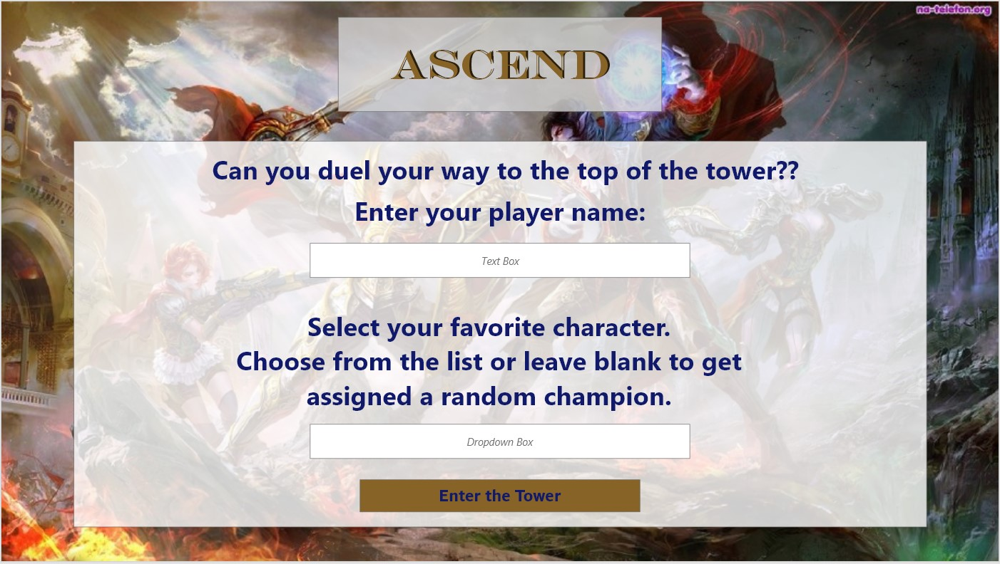
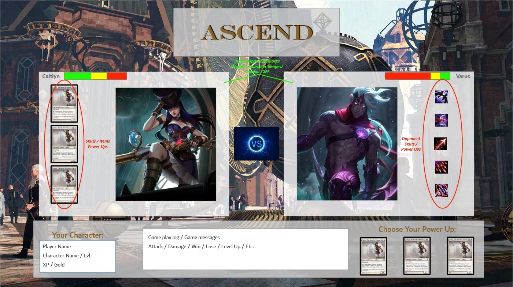
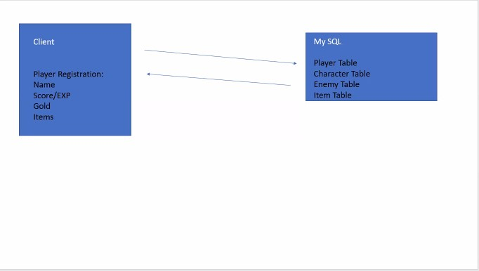

# Ascend

## Table of Contents
  * [Description](#description)
  * [User Story](#userstory)
  * [Wireframes](#demo)
  * [APIs to be Used](#apis)
  * [Contributing to This Project](#contributefaq)

  
## Description
Choose a character and duel your way through various creatures and bosses to the top of the tower.

## User Story
I want to kill some time killing random creatures in an attempt to reach the final boss (top of the tower). I want to be able to enter my player name, select a character or have a character selected for me, and then battle random opponents for virtual cash and prizes.

Intended for use by anyone who wants to play a simple web based video game.

## Wireframes

## APIs to be Used
To start we will be building our own, but are also looking to possibly utilize external APIs for characters, creatures, and/or items should time allow. External APIs, if used, are yet to be decided.

## Contributing to This Project
This project can be found on Github at [Ascend](https://github.com/alanhuynh1021/Ascend)

The project team includes:
 - Alan Huynh - [alanhuynh1021](https://github.com/alanhuynh1021) - <em>Concept Development, Project Repo, Heroku, DB/API Input</em>
 - Alex Nieves - [ajsnow56](https://github.com/ajsnow56) - <em>Concept Development, DB/API Input, Initial Datasets, DB Wireframe</em>
 - Bradley Campbell - [Bradleycampbell00](https://github.com/Bradleycampbell00) - <em>Concept Development, Node Package Research,  DB/API Input</em>
 - Theresa Grier - [TreeGee73](https://github.com/TreeGee73) - <em>Concept Development, UI Wireframes, DB/API Input</em>

 The above tasks are highlights of the tasks tackled by each team member so far. The overall breakdown of tasks will be determined organically as we work through the build.